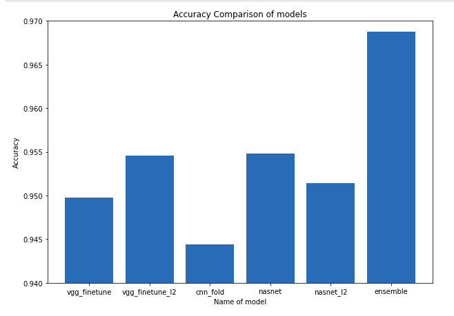

```
Team Name : The Alphas

Authors : Pritam Rao and Ashay Ajbani

Competition Type : Image Classification

Solution Type : Transfer Learning and  Ensembling

Number of Classes : 2

Pretrained Models Used : VGG16 and NASnet Large

Private Leaderboard Rank : 36/10000
```

The competition was hosted on ```https://www.analyticsvidhya.com/```.
The task was to classify vehicles into emergency and non-emergency categories.

### Our Approach
We trained 5 models using tranfer learning and ensembled them to make final predictions. 

**Models** : 

* Model 1 : Fine Tuning VGG16 
* Model 2 : Fine Tuning VGG16 with l2 regularization 
* Model 3 : k-fold validation 
* Model 4 : Fine Tuning NASnet 
* Model 5 : Fine Tuning NASnet with l2 regularization


The predictions taken by ensembling above 5 models
resulted in an accuracy greater than any of the individual models. 

Techniques used to reduce overfitting : 
* Data Augmentation 
* BatchNormalization 
* Dropout 
* l2 Regularization 
 

## Model Comparison 


You can checkout Aashay's github profile at ```https://github.com/ashay36```
